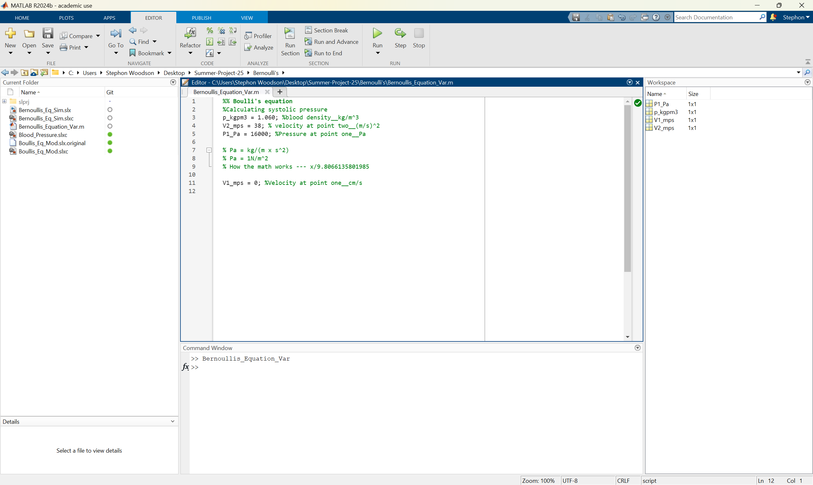
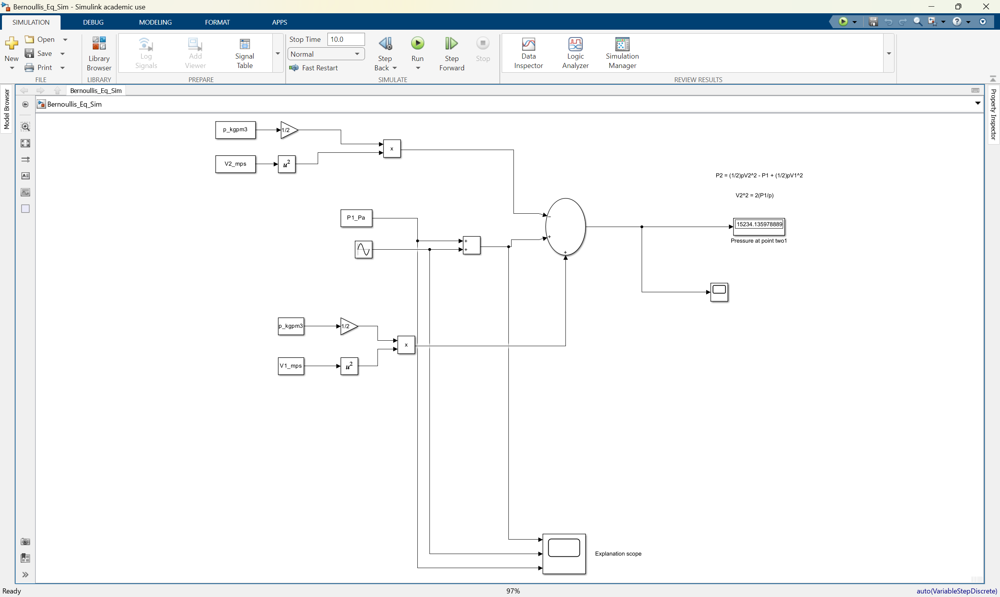

## Stephon's 2025 Project
The goal of this project is to model plaque buildup within a coronary artery. The following things will be modeled:
- Plaque buildup within a coronary artery
- Change in blood pressure as a result of plaque buildup
- Graphs demonstrating change in blood pressure
- Bernoulli's Equation
- Cross Sectional Area
- Gaussian Distribution

## How to properly use the software
1. Open the Bernoulli’s equation folder, once in the folder locate the files `Bernoullis_Eq_Sim.slx` and `Bernoullis_Equation_Var.m`.
2. Run the `.m` file to load the variables into the workspace.
3. The variables that need to be loaded in are named `V1_m/s`, `V2_m/s`, `P1_Pa`, and `p_kgpm3`.
* Below is an example of what the matlab program should look like after running the code

4. Run the Simulink program.
* Once you have run the Simulink program you will see the estimated blood pressure to the right at the end of the code in the display window named "pressure at point two1" in simulink.
* 
5. When you are ready to experiment with different numbers you will start by changing the variable of velocity at point 2 `V2_m/s` to a number within a reasonable range of blood velocity within an artery. It is advised to use numbers around 38. If the number is too high, or low Simulink will produce unrealistic results.
* NOTE - If you find units form the internet ensure that you properly convert your units into m/s.
6. Blood density `p_kgpm3` is a constant that does not need to undergo any changes, if this variable is not 1.060 then Simulink will produce unrealistic numbers.
7. Pressure at point 1 `P1_Pa` can be changed within a realistic range. This range is 1200Pa-1600Pa.
8. Velocity at point 1 `V1_m/s` will always be zero. Under no circumstances should this number change otherwise the equation will be inaccurate.

Once you have become familiar with the software, and tested multiple variables, now move onto the continuity equation. The continuity equation is an addition to the previous Bernoulli’s equation to better model a real artery. Instead of making estimations for velocity of blood flow at point two `V2`, which is after the plaque build, this program provides a more accurate way to calculate said velocity. This uses volumetric flow rate of blood, and the coronary artery's cross-sectional area to calculate plaque buildups effect on the blood pressure. This addition will replace Velocity at point two `V2` with volumetric flow rate over cross sectional area `Q/A`.

9. Close everything from before and open the Continuity folder, once in the continuity folder locate the files `contiunity.slx` and `continuity_variable.m`.
10. Run the `.m` file to load the variables into the workspace
* Variables that should be seen are named `p_kgpm3`, `P1_Pa`, `Q_m3pa`, and `A2_m`.
11. Run the Simulink program.
* There will be two display windows on the right, both displaying the estimated blood pressure after the plaque buildup, if the code is running properly the numbers will be the same.
12. The only variables that will be changed are `A2_m` and `Q_m3ps`
13. The A2_m variable should be around 0.000001m. If you want to insert a specific cross-sectional area, ensure that you properly convert your units to meters squared, and that you are using a cross-sectional area that is appropriate for a coronary artery.
14. The variable `Q_m3ps` should be around 0.0000015. If you find a specific volumetric flow rate ensure that you properly convert into meters cubed per second, and that you are using a volumetric flow rate that is appropriate for a coronary artery.

Once you are finished experimenting and plugging in different values for the volumetric flow rate and cross sectional area we will be moving on to using the gaussian distribution. This change gives us a more accurate simulation of the plaque buildup. Instead of finding the cross-sectional area to represent the plaque buildup, we will instead use the gaussian distribution to represent a gradual increase and a gradual decrease of plaque buildup, which is more commonly seen in a coronary artery.

15. Close the previous program.
16. Open the Gaussian folder, once in this folder open the `Gaussian_Principle.slx` and `Gaussian_Variable.m`.
17. Run the `m.` file to load the variables into the workspace
* Variables that should be seen are named `p_kgpm3`, `V2_mps`, `P1_Pa`, `Q_m3ps`, `pi_nd`, `x_m`, `x0_m`, `r0_m`, `Dr_m`, `sig_m`.
18. Run the Simulink program.
* The estimated blood pressure will show in a display window towards the right in simulink.
19. The only variables that will stay constant is `V2_mps`, `P1_Pa`, `p_kgpm3`, `x0_m`, `pi_nd`, and `r0_m`.
20. `sig_m` will be the width of plaque buildup. I advise this number to stay around 0.0009m as you become more familiar with the formula. However, this number can be anything as long as it stays realistic to the width of a coronary artery. Meaning it cannot be too large or too small.
21. `deltaRadius_m` is the maximum amount of artery radius reduction at the center. This is how much the radius of the coronary artery is reduced due to the plaque buildup. This number can be anything around 0.001m. This number can be experimented with; however, this cannot be larger than 0.002m, or a radius that is too small for a coronary artery. This will result in the simulation giving inaccurate numbers.
22. `x_m` is the position along the coronary artery. If this number is further away from 0.001, ex 0.002, then this will model a relatively flat plaque buildup. The closer this value is to 0, the steeper the plaque buildup.

Within all these equations in the simulink files, which are the files with `.slx`, under the display window there will be a scope window. This scope window provides a sine graph which helps provide a visual representation of how the blood pressure will fluctuate due to the plaque buildup. 

